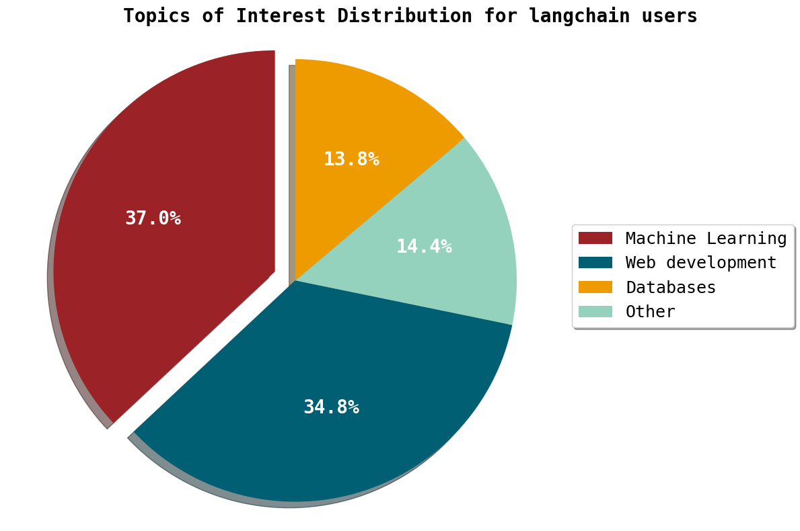

# 🌟 Stargazers Reloaded

## LLM-Powered Analysis of Your GitHub Community 🐙

GitHub 🌟 are like badges of honor in the dynamic software development realm. They symbolize a repository's popularity in the developer community. Whether you're a developer, open-source enthusiast, or just curious about tech trends, these stars provide insights into the coding community.

What if we could delve into the minds of these star-givers, extracting insights from their profiles to understand their interests, locations, and more? In this app, we show how [EvaDB](https://github.com/georgia-tech-db/evadb) makes it super easy to get insights about your GitHub community using large language models (LLMs). 

This app is inspired by the "original" [Stargazers app](https://github.com/spencerkimball/stargazers) written by Spencer Kimball from Cockroach Labs. While the original app focused on analyzing the community exclusively using the GitHub API, our LLM-powered Stargazers app powered by EvaDB also extracts insights from unstructured data obtained from the stargazers' webpages.

## LLM Cost Optimizations

To generate the most accurate results, this app can directly use GPT-4 to generate the entire structured data. However, GPT-4 calls are **40 times** more expensive per row than GPT-3.5 calls. It takes **$60** to process just **1000 users**. So, this app uses a **model cascade optimization** to generate high-quality insights at a fraction of the cost. Additionally, with EvaDB, it is easy to **batch** input user rows to GPT-4 to further reduce the cost of the query.  Using these optimizations, we found that the app has **11x lower cost** than a standalone GPT-4 model. The batching optimization is implemented in [chatgpt_batch.py](functions/chatgpt_batch.py).

## Getting Started

First install the dependencies:

```bash
pip install -r requirements.txt
```

Then, add the following environment variables to a `.env` file in the root directory of the project (see `example.env`):

```
REPO_URL=<url of the repo to analyze>
GITHUB_API=<your-github-personal-access-token>
OPENAI_API=<your-openai-api-key>
```

Finally, run the app:

```bash
python stargarzers.py
```

## How it Works


The app uses EvaDB to generate insights about your stargazers in four steps:

1. **Collecting stargazers**: The app uses the GitHub API to collect the profile information of the stargazers of the repo specified in the `REPO_URL` environment variable.

```SQL
--- List of Stargazers
CREATE TABLE gpt4all_StargazerList AS
  SELECT GithubStargazers("https://github.com/nomic-ai/gpt4all", "GITHUB_KEY");

--- Details of Stargazers extracted using the Github API
CREATE TABLE gpt4all_StargazerDetails AS
  SELECT GithubUserdetails(github_username, "GITHUB_KEY")
  FROM gpt4all_StargazerList;
```

The `GithubUserdetails` function is implemented in [`github_user_details.py`](functions/github_user_details.py).

2. **Scraping stargazers' profiles**: The app then takes screenshots of stargazers' user profile pages and uses [`EasyOCR`](https://github.com/JaidedAI/EasyOCR) to extract unstructured text blobs from the screenshots, all in one query.

```SQL
--- Text in webpages of Stargazers extracted using WebPageTextExtractor
CREATE TABLE gpt4all_StargazerScrapedDetails AS
  SELECT github_username, WebPageTextExtractor(github_username)
  FROM gpt4all_StargazerList;
```

Check [`webpage_text_extractor.py`](functions/webpage_text_extractor.py) for more details on how the `WebPageTextExtractor` function performs the scraping.

3. **Generating insights**: The app then uses GPT-3.5 to generate insights about the stargazers' interests and needs, using the text blobs extracted in the previous step. We use a custom prompt to guide the generation process and ensure that the generated insights are relevant to the repo. You can modify the prompt to suit your needs.

```Plain Text
--- Prompt to GPT-35
You are given a block of disorganized text extracted from the GitHub user profile of a user using an automated web scraper. The goal is to get structured results from this data.
Extract the following fields from the text: name, country, city, email, occupation, programming_languages, topics_of_interest, social_media.
If some field is not found, just output fieldname: N/A. Always return all the 8 field names. DO NOT add any additional text to your output.
The topic_of_interest field must list a broad range of technical topics that are mentioned in any portion of the text.  This field is the most important, so add as much information as you can. Do not add non-technical interests.
The programming_languages field can contain one or more programming languages out of only the following 4 programming languages - Python, C++, JavaScript, Java. Do not include any other language outside these 4 languages in the output. If the user is not interested in any of these 4 programming languages, output N/A.
If the country is not available, use the city field to fill the country. For example, if the city is New York, fill the country as United States.
If there are social media links, including personal websites, add them to the social media section. Do NOT add social media links that are not present.
Here is an example (use it only for the output format, not for the content):

name: logicx
country: United States
city: Atlanta
email: abc@gatech.edu
occupation: PhD student at Georgia Tech
programming_languages: Python, Java
topics_of_interest: Google Colab, fake data generation, Postgres
social_media: https://www.logicx.io, https://www.twitter.com/logicx, https://www.linkedin.com/in/logicx
```

```SQL
--- Using LLMs to extract insights from text
CREATE TABLE gpt4all_StargazerInsights AS
  SELECT StringToDataframe(GPT35("{LLM_prompt}", extracted_text))
  FROM gpt4all_StargazerScrapedDetails;
```

If you want to generate different insights with other column names, you can modify the prompt and the `StringToDataframe` function in [`string_to_dataframe.py`](functions/string_to_dataframe.py).

4. **Improving insights**: GPT-3.5 does not work well for all the columns. For example, it cannot categorize user interests into popular topics of interest effectively. To improve the quality of the insights, we use a Cascade of LLMs to generate insights for the `topics_of_interest` column.
First, the GPT-3.5 query above generates a broad list of topics of interest. The semi-organized results are then processed by the more powerful GPT-4 model to generate a more focused list.

```Plain Text
--- Prompt to GPT-4
You are given 10 rows of input, each row is separated by two new line characters.
Categorize the topics listed in each row into one or more of the following 3 technical areas - Machine Learning, Databases, and Web development. If the topics listed are not related to any of these 3 areas, output a single N/A. Do not miss any input row. Do not add any additional text or numbers to your output.
The output rows must be separated by two new line characters. Each input row must generate exactly one output row. For example, the input row [Recommendation systems, Deep neural networks, Postgres] must generate only the output row [Machine Learning, Databases].
The input row [enterpreneurship, startups, venture capital] must generate the output row N/A.
```

```SQL
--- Deeper insights using an expensive LLM prompt
CREATE TABLE IF NOT EXISTS
sqlite_data.{repo_name}_StargazerInsightsGPT4 AS
SELECT name,
 country,
 city,
 email,
 occupation,
 programming_languages,
 social_media,
 GPT4("{LLM_prompt}",topics_of_interest)
FROM sqlite_data.{repo_name}_StargazerInsights;
```

## Results

The app generates a CSV file with insights about your stargazers in the [`results`](results/) folder. We provide a sample CSV output file. To generate visualizations from the insights, run the following command:

```bash
python visualize_results.py
```

The visualizations are saved in the [`images`](images/) folder.

Here are some interesting trends that we found in the [GPT4All](https://github.com/nomic-ai/gpt4all), [Langchain](https://github.com/langchain-ai/langchain), and [CockroachDB](https://github.com/cockroachdb/cockroach) communities:

**Web developers ❤️ open-source LLMs 🤩**

<p align="center">
  
  &nbsp;&nbsp;
  
</p>

**Langchain is most popular 📈 in the Machine Learning 🤖🧠 interest groups**

<p align="center">
  
  &nbsp;&nbsp;
  
</p>

**CockroachDB is most followed by Database developers 📊 in the United States 🇺🇸**

<p align="center">
  
  &nbsp;&nbsp;
  
</p>

## EvaDB Shoutout

👋 Hey! If you're excited about database systems for AI applications, show some ❤️ by:
<ul>
  <li> 🐙 giving a ⭐ on our <a href="https://github.com/georgia-tech-db/evadb">EvaDB repo on Github</a>
  <li> 📟 joining our <a href="https://evadb.ai/community">Slack Community</a>
  <li> 🐦 following us on <a href="https://twitter.com/evadb_ai">Twitter</a>
  <li> 📝 following us on <a href="https://medium.com/evadb-blog">Medium</a>
</ul>
